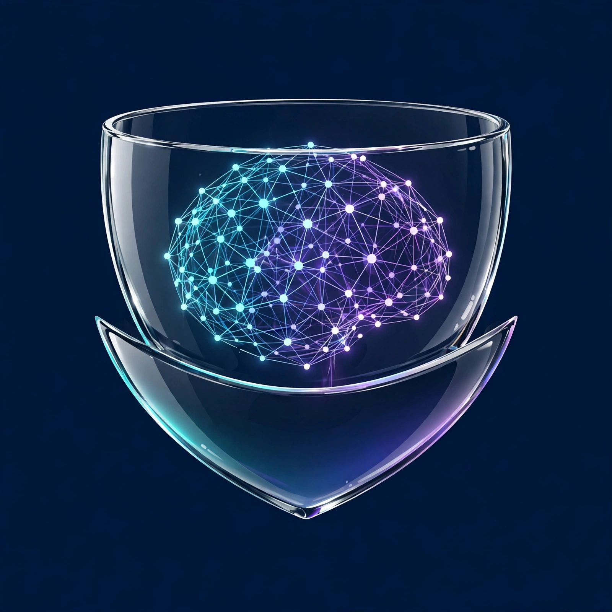

# Hull



**Self-healing virtual computers for AI agents.**

> **🕹️ [Try the interactive demo — Mission Control](https://mtg9t4.github.io/hull/)** — dispatch maneuvers in your browser, inject failures, and watch the pilot's self-healing retries save the mission. No install needed.

Hull is a unified Python framework for building, training, and deploying intelligent pilots — AI agents that act across digital and physical environments. Every pilot gets a sandboxed, resource-managed runtime that keeps it running: automate a desktop, drive a robot, learn from demonstrations, record and replay episodes.

> [!WARNING]
> **Early Alpha** — APIs and behavior will change without notice.

## Overview

`hull` provides a flexible architecture for creating pilots that can:
- **Automate desktop applications** via GUI interaction
- **Control physical robots** through simulation and hardware interfaces
- **Learn from demonstrations** using imitation learning and reinforcement learning
- **Record and replay** episodes for testing and training
- **Bridge multiple environments** with unified connector interfaces

## Key Features

- **Desktop Automation** - Click, type, and interact with GUI elements
- **Robot Control** - MuJoCo simulation and physical robot support (Brewie)
- **Learning Algorithms** - Imitation learning, Pi0, and custom algorithms
- **Episode Recording** - Capture and replay pilot sequences
- **Modular Connectors** - Extensible interface for any environment
- **Validation & Safety** - Built-in sentinel guards and validators
- **Training Pipeline** - Dataset management and model training
- **On-chain Vault** - Solana-backed episode ledger for verifiable pilot history
- **Self-Healing Execution** - Automatic retries with exponential backoff, per-maneuver timeouts, and bridge health checks

## Installation

### Basic Install
```bash
pip install hull
```

### With Optional Dependencies
```bash
# Desktop automation
pip install hull[desktop]

# MuJoCo simulation
pip install hull[simulation]

# Physical robot control (Brewie)
pip install hull[robot]

# All features
pip install hull[desktop,simulation,robot]
```

### Development Install (using uv)
```bash
git clone https://github.com/MTG9T4/hull

cd hull

uv sync --dev
```

## Quick Start

### Desktop Automation

Create a pilot that automates login:

```python
# my_app/pilots/login.py

from hull.pilot import Pilot
from hull.bridge.desktop import DesktopBridge

async def login_pilot():
    op = Pilot({"desktop": DesktopBridge()})

    # Click username field
    await op.execute_maneuver("click", selector="#username")
    await op.execute_maneuver("type", text="demo_user")

    # Click password field
    await op.execute_maneuver("click", selector="#password")
    await op.execute_maneuver("type", text="secure_pass")

    # Submit form
    await op.execute_maneuver("click", selector="#submit")

    return op
```

### Robot Control (MuJoCo Simulation)

Control a simulated robot:

```python
# my_app/pilots/robot_sim.py

from hull.pilot import Pilot
from hull.drydock.mujoco import MuJoCoSimulation

async def robot_pilot():
    sim = MuJoCoSimulation("models/robot.xml")
    op = Pilot({"robot": sim.get_connector()})

    # Move to target position
    await op.execute_maneuver("move",
                           bridge_name="robot",
                           position=[0.5, 0.3, 0.2])

    # Grasp object
    await op.execute_maneuver("grasp",
                           bridge_name="robot",
                           force=10.0)

    return op
```

### Physical Robot Control (Brewie)

Control a physical Brewie robot:

```python
# my_app/pilots/brewie_robot.py

from hull.pilot import Pilot
from hull.bridge.robot import BrewieRobot

async def brewie_pilot():
    # Initialize Brewie robot connector
    robot = BrewieRobot(host="192.168.1.100", port=9090)
    op = Pilot({"brewie": robot})

    # Connect to robot
    await op.execute_maneuver("connect", bridge_name="brewie")

    # Get current robot state
    state = await op.get_state("brewie")
    print(f"Joint positions: {state.metadata['joint_positions']}")

    # Move robot joints to target positions
    await op.execute_maneuver("move",
                           bridge_name="brewie",
                           positions={13: 800, 14: 200, 15: 700},
                           duration=2.0)

    # Disconnect
    await op.execute_maneuver("disconnect", bridge_name="brewie")

    return op
```

## Self-Healing Execution

Pilots absorb failure instead of crashing on it. Every maneuver can retry with exponential backoff, time out, and report bridge health:

```python
from hull.pilot import Pilot
from hull.bridge.desktop import DesktopBridge

async def resilient_login():
    pilot = Pilot({"desktop": DesktopBridge()})

    # Retry flaky maneuvers up to 3 times, 10s max per attempt
    await pilot.execute_maneuver("click", selector="#submit",
                                 retries=3, timeout=10.0)

    # Check every bridge is alive before a critical run
    health = await pilot.health_check()
    assert all(status == "ok" for status in health.values())
```

Tasks can carry the same options:

```python
await pilot.run({
    "bridge": "desktop",
    "maneuver": "type",
    "params": {"text": "hello"},
    "retries": 2,
    "timeout": 5.0,
})
```

## Core Concepts

### Pilots
The main abstraction for defining automated behaviors. Pilots can work with multiple bridges simultaneously.

### Bridges
Interfaces to different environments (desktop, robot, web, etc.). Each bridge provides state observation and maneuver execution.

### Engines
Learning engines for training pilots from demonstrations or through reinforcement learning.

### Episodes
Recorded sequences of states and maneuvers that can be replayed or used for training.

### Watch
Safety and validation layer that ensures pilots behave within defined constraints.

## Roadmap

- [ ] Cloud API bridges
- [ ] Distributed pilot coordination
- [ ] Model zoo with pre-trained pilots
- [ ] Real-time monitoring dashboard

## License

MIT — see [LICENSE.md](LICENSE.md) for attribution.

## Credits

Hull builds on the pioneering work of [CodecFlow](https://github.com/codecflow) and their open-source [optr](https://github.com/codecflow/optr) project (MIT licensed), which originated the virtual-OS-for-AI-agents architecture. Hull extends it with a restructured codebase, a renamed public API, and new self-healing execution features (retries, timeouts, health checks). We are grateful to the CodecFlow team for releasing their work openly.
